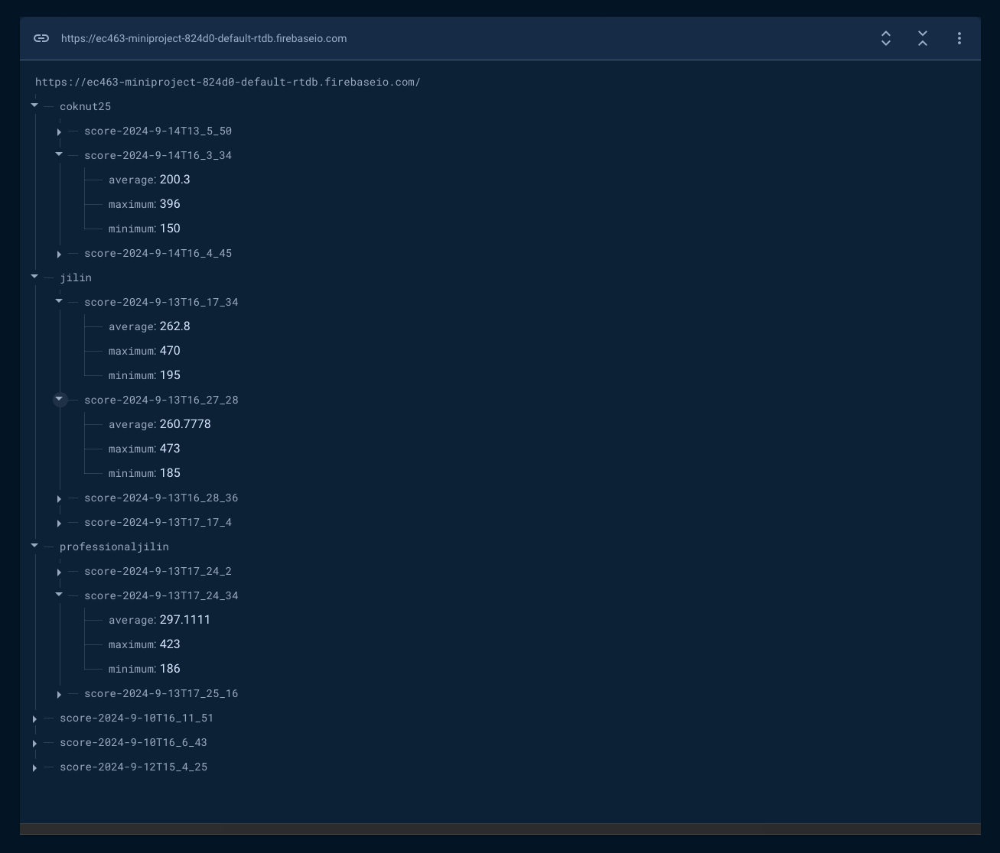

# EC463 Miniproject Report - Jilin Zheng, Cole Knutsen

## Exercise 1

The values found were:

- max_bright = 23000
- min_bright = 48000

based on the West campus dining hall lighting in the evening.

## Exercise 2

Please refer to [exercise_sound.py](assignment/exercise_sound.py).

## Exercise 3

Please refer to [exercise_game.py](assignment/exercise_game.py) for code and [README.md](./README.md) for additional usage details. The Firebase Realtime Database used is [here](https://console.firebase.google.com/u/3/project/ec463-miniproject-824d0/database/ec463-miniproject-824d0-default-rtdb/data/~2F).

The 'flow' of the hardware game to the cloud storage + web application is as follows (note that everything is in a development environment here, so in a production environment things would not be as tedious/require as much manual set up for the user...):

- Users will modify the Pi Pico script in [exercise_game.py](assignment/exercise_game.py) to include their email, Wi-Fi details, and Firebase storage link
- After playing the game, the user's game data will be uploaded to Firebase Realtime Database for retrieval with the web application
- To run the web application, refer to [README.md](./README.md)
- Upon opening the web application, users can log in with the same email they used in the [exercise_game.py](assignment/exercise_game.py) script, and retrieve their data

A screenshot of the Realtime Database is below:

